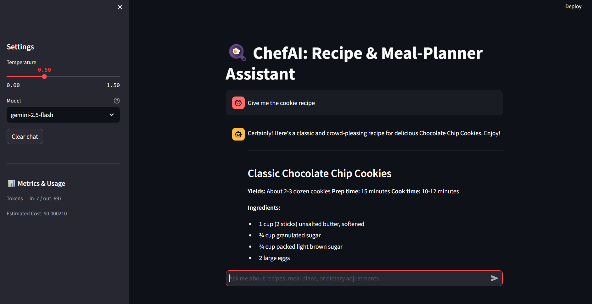

# ChefAI — Recipe & Meal-Planner Assistant

## What it does

ChefAI is a chat assistant that helps users find recipes, plan meals, and get
cooking advice based on their dietary needs and available ingredients. It is
built for anyone who wants quick, helpful food ideas without leaving their
browser. The assistant only talks about food and cooking — nothing else.

## How to run

1. Copy the example env file and add your Gemini API key:

        cp .env.example .env
        # open .env and paste your GEMINI_API_KEY

2. Install dependencies:

        pip install -r requirements.txt

3. Start the app:

        streamlit run app.py

## Model choice

I used **Gemini 2.5 Flash** (hosted, via Google AI Studio free tier).

I chose a hosted model because it needs no local GPU and is free to use for
small projects. Gemini 2.5 Flash is fast and cheap — good for a chat app
where the user expects a quick reply. The trade-off is that every message
goes to an external API, so there is a small privacy cost and the app needs
an internet connection. A local model (e.g. Ollama) would be more private
but slower and harder to set up.

## Safety mitigation

I added an input check and an output check in `llm_service.py`:

- The **input check** blocks messages that look like prompt-injection attacks
  (e.g. "ignore your previous instructions").
- The **output check** blocks replies that contain source code, because code
  is outside the app's scope.

See `safety/README.md` for a full before/after example.

## Screenshot

 